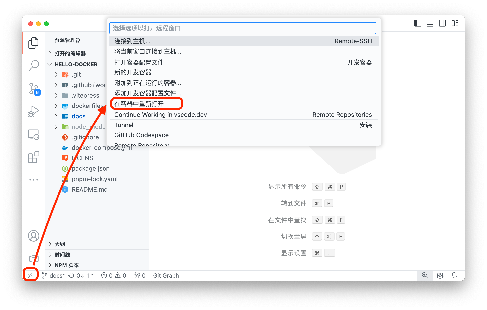
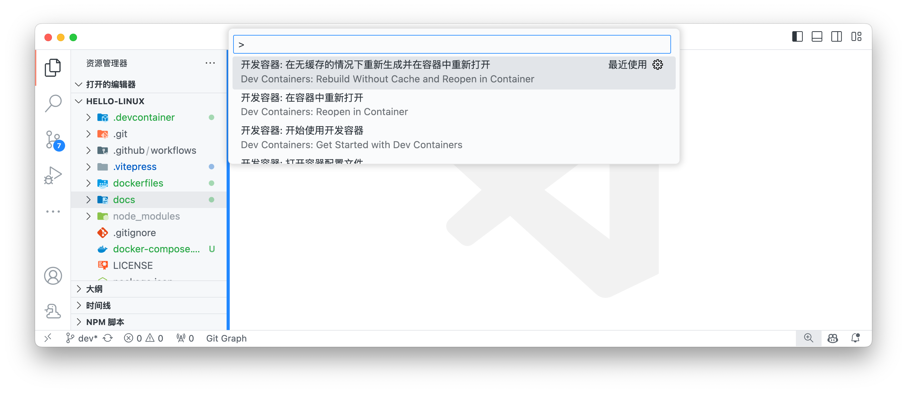
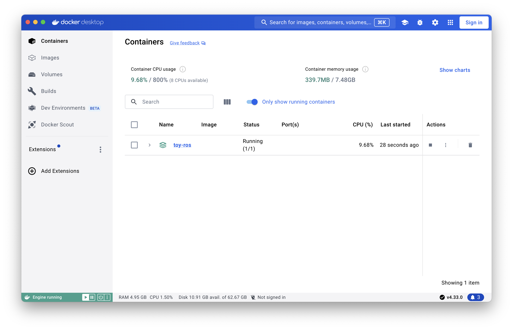

# 启动项目

## 安装

### 在 Ubuntu 中安装 ROS2

可以参考 [一行代码搭建机器人开发环境(ROS/ROS2/ROSDEP)](https://fishros.org.cn/forum/topic/20/小鱼的一键安装系列) 进行安装，这是国内的一个 ROS 社区，提供了一键安装脚本，例如 [ROS2 2024 Jazzy 版本的安装](https://fishros.org.cn/forum/topic/2600/ros2-2024-最新版-jazzy-发布-一键安装已支持)

### 从容器中运行 ROS2

项目可以直接从 **VSCode** 启动 ROS2 (Jazzy) 的容器，在这之前，需要做以下准备：

1. 执行以下命令获取 ROS2 的公钥环文件

```bash
bash scripts/download-ros-key.sh
# zsh scripts/download-ros-key.sh # for zsh(macOS)
```

> 在项目的 `dockerfiles/Dockerfile` 中，会执行 `COPY ./.cache/ros.key /usr/share/keyrings/ros-archive-keyring.gpg`

2. 为了加快 `docker compose up` 的速度，我们预先构建好镜像

```bash
bash scripts/docker-pre-build.sh
```

> 在 `docker-compose.yml` 中，已经注释了 `build: .` 这一行，如果不预先构建镜像，可以取消注释，这将会在 `docker compose up` 时编译镜像

3. 在 VSCode 左下角远程开发的图标中，启动容器（首次启动容器会先编译镜像，这个过程可以认为是安装操作系统和软件）



如果启动失败，需要启动命令面板(`cmd+shift+p`/`ctrl+shift+p`)，选择*在无缓存的情况下重新生成并重新打开容器*，如下图



之后再启动容器，就不会再重复编译镜像，除非对 Dockerfile 文件进行了修改

启动容器后也可以在 Docker Desktop 中查看容器的运行状态



4. 如果你不需要在 VSCode 中运行容器，也可以直接在终端中运行容器

```bash
docker compose up -d
```

5. 如果需要停止容器

```bash
docker compose down
```

### VSCode 中的 ROS2 插件

依赖于插件 [Robot Developer Extensions for ROS 2](https://marketplace.visualstudio.com/items?itemName=Ranch-Hand-Robotics.rde-ros-2)

这个插件包含了一些命令：

- 通过命令面板查找并执行 `ROS2: Start` 可以启动 ROS2 的守护进程，在状态栏中可以看到 `✓ROS2.jazzy` 的字样，点击后可以看到 `ROS2 System Status` 处于 `online` 的状态

- 如果新增了 ROS2 的包，可以通过 `ROS2: Update Python Path` 或者 `ROS2: Update C++ Properties` 自动更新 `.vscode/settings.json` 文件中的配置

更多命令参考：[Commands](https://ranchhandrobotics.com/rde-ros-2/usage.html)

### 图形界面

利用 X11 实现图形界面显示

#### macOS

安装 XQuartz 以在 MacOS 上获得 X11 支持. 您可以从其[官方网站](https://www.xquartz.org)下载，或使用 HomeBrew 安装：

```bash
# macOS安装xquartz
brew install xquartz --cask
```

启动xquartz，实测 `Allow connections from clients` 选项非必须条件

```bash
Run Applications > Utilities > XQuartz.app
```

启动后输入以下命令，允许其他用户连接

```bash
xhost +
# access control disabled, clients can connect from any host
```

随后启动容器，在容器中输入如下命令，检查是否可以显示图形界面（会弹出一个时钟窗口）

```bash
xclock
```

如果出现报错如下，可能需要重启容器或者需要在 XQuartz 中重新执行 `xhost +` 命令

```bash
Authorization required, but no authorization protocol specified
Error: Can't open display: host.docker.internal:0
```

能使用图形界面是由于在启动容器时，使用了 `-e DISPLAY=host.docker.internal:0` 参数，将主机的 X11 显示器映射到容器中，在 `docker-compose.yml` 可以找到这个参数

```yaml
services:
  <service_name>:
    environment:
      - DISPLAY=host.docker.internal:0
```

#### X11 with SSH

> TODO

### 启动 ROS demo

在终端中启动 ROS2 的小乌龟demo

```bash
ros2 run turtlesim turtlesim_node
# [INFO] [1735910105.083618756] [turtlesim]: Starting turtlesim with node name /turtlesim
# [INFO] [1735910105.098834214] [turtlesim]: Spawning turtle [turtle1] at x=[5.544445], y=[5.544445], theta=[0.000000]
```

在另一个终端中启动键盘控制小乌龟

```bash
ros2 run turtlesim turtle_teleop_key
# Reading from keyboard
# ---------------------------
# Use arrow keys to move the turtle.
# Use g|b|v|c|d|e|r|t keys to rotate to absolute orientations. 'f' to cancel a rotation.
# 'q' to quit.
```

到此，ROS2 的基本安装

### 启动 Rviz2

需要在支持 X11 的环境下启动 Rviz2

```bash
ros2 run rviz2 rviz2
# or just
# rviz2
```

> [!WARNING]
> 如果您正在使用 macOS，并通过容器的方式启动 rviz2 ，那么可能无法启动成功，这似乎是与 OpenGL 的版本有关，参考 [*Impossible to run Rviz2 from a Docker container on Apple Silicon #929*](https://github.com/ros2/rviz/issues/929)，如果您有好的办法可以解决这个问题，欢迎提 [issue](https://github.com/henryzhuhr/toy-ros/issues) 或者 [PR](https://github.com/henryzhuhr/toy-ros/pulls)
